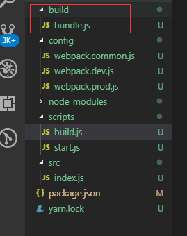
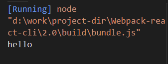

## 安装webpack、webpack4

    yarn add webpack webpack-cli webpack-merge -D

## 创建配置目录结构

    config
        webpack.common.js
        webpack.dev.js
        webpack.prod.js

    scripts
        build.js  // 构建模式脚本
        start.js  // 开发模式脚本

    src
        index.js

    package.json

## 编写基本配置

- 配置启动脚本命令

    > package.json

        ...
        "license": "MIT",
        + "scripts": {
        +     "start": "node ./scripts/start.js",
        +     "build": "node ./scripts/build.js"
        + },
        "devDependencies": {
            "webpack": "^4.35.2",
            "webpack-cli": "^3.3.5"
        }
        ...

- 编写webpack配置, 以 `src/index.js` 作为主入口，以 `build`为打包后的目录

    > config/webpack.common.js

        const path = require('path');

        module.exports = {
            entry: "./src/index.js",
            output: {
                path: path.resolve(__dirname, "../build"),
                filename: "bundle.js"
            }
        }

    ***output path字段这里配置的绝对路径***

- 编写开发模式运行脚本

    > scripts/build.js

        const webpack = require('webpack');
        const webpackConfig = require('../config/webpack.common.js');

        webpack(webpackConfig, (err, stats) => {
            if(err || stats.hasErrors()){
                console.log("编译失败");
            }
        });

    ***webpack node接口文档： https://www.webpackjs.com/api/node/***

- 在入口编写一点内容

    > src/index.js

        console.log('hello')

- 执行 `yarn build` 命令，生成打包目录

    

    运行生成的bundle.js

    

## 配置开发模式 - webpack-dev-server

- 安装

    yarn add webpack-dev-server -D

- 配置两种模式下的webpack配置文件

    

## 配置插件 `clean-webpack-plugin`、 `html-webpack-plugin`， 这两个插件基本上是必配的了

- 简介

    - clean-webpack-plugin - 每次打包时清理上次打包生成的目录

    - html-webpack-plugin - 生成打包文件中的 index.html

- 安装

    yarn add clean-webpack-plugin html-webpack-plugin -D

    